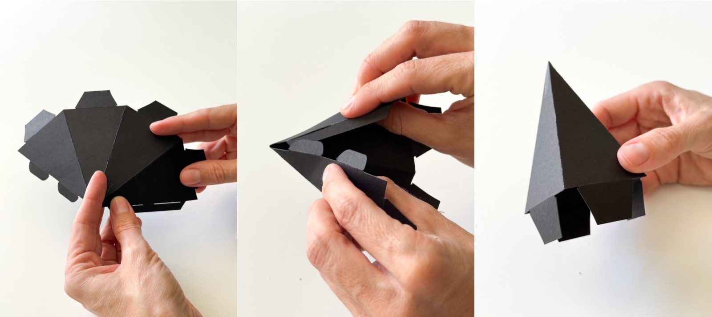
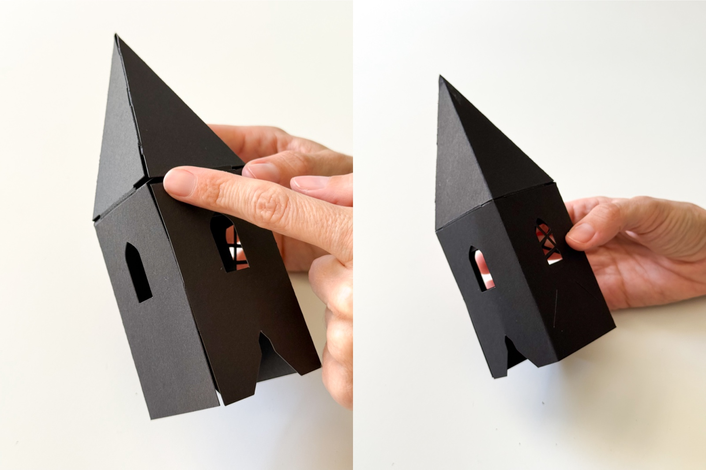
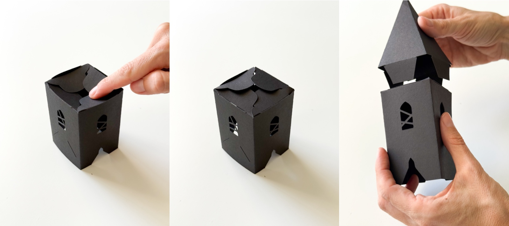

# Halloween Church Paper House Assembly Instructions

## Step 1: Prepare the main body

1. Take the main body of the church
2. Find all the fold lines and fold them away from you
3. Once everything is folded, connect the two sides together
4. Now the base of your church is ready

## Step 2: Attach the porch front

1. Take the porch piece (the one with the bat design)
2. Fold along all the scored lines, again away from you
3. Insert the tabs into the slots on the main body and secure them by folding the tabs inward
4. Now the porch is attached

## Step 3: Add the roof

1. Fold the roof along the scored line
2. Notice the cut-out in the middle of the roof — it should fit over the porch front
3. Place the roof on top to check alignment before gluing
4. Apply glue on the tabs of the roof (and you can also add some glue inside along the slots)
5. Start with the back side: attach the roof, check that the edges are even, and press to secure
6. Then attach the front side with the cut-out, fitting it neatly over the porch. It's easier to do this with the piece resting on the edge of a table

## Step 4: Assemble the tower top

1. To make the upper cone, fold along all the scored lines for the entire cone piece
2. Insert the tabs into the slots - it holds well on its own
3. Take the second piece and fold away from you along the scored lines as well
4. Secure with the tabs
5. You can leave the tower like this, or add another detail
Place the rectangular piece on top of the cone - it fits perfectly

## Step 5: Attach the tower

1. Fold each part of the tower along the scored lines, away from you
Secure with the locking connections
2. Place the cone top onto the tower base so the tabs go into the slots
3. Insert the tower into the special cut-out on the church body

## Step 6: Add the porch roof

Find the small porch roof piece and insert it into the slots on the tower. Add glue if needed.

## Step 7: Final detail

Take the cross piece, apply glue, and attach it to the top of the cone.

## Your church is complete - congratulations!

---

[Back to Instructions](index.md) | [Visit our Etsy Shop](https://www.etsy.com/shop/PaperCraftHouses)